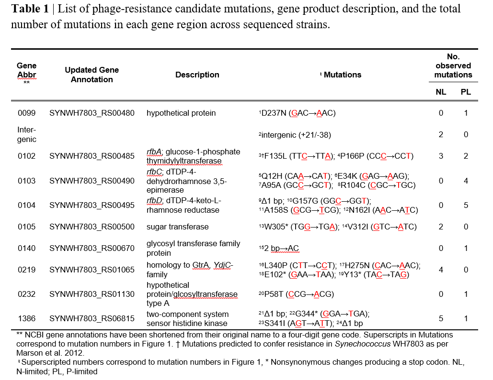

Table 1of ML's paper has a list of mutations found in phage-treated chemostats. mutations are aggregated by genes and parse between N- and P- limitations

 

I have found a mistake in parsing the mutation data for testing the genetic-phenotypic correlation. I want to see if that mistake was local to that analysis or more general. I will try and independently derive the summary in table 1 from the data available on MLs repo.  
I will import the data explored in _exploring the data.Rmd_.

```{r}
rm(list=ls())
library(tidyverse, quietly = TRUE)
library(cowplot, quietly = TRUE)
# table of strains and their source (time, treatment)
strains <- read_csv("../data/strains.csv")
# remove ansector
strains <- filter(strains,strain_ID!="WH7803")
rbind(head(strains,n=3), rep("...",ncol(strains)),tail(strains,n=3))
```  

```{r}
# data on mutations found in each strain. Requires processing
breseq <- read_csv("../data/breseq.compare.csv")#,na = "?")
rbind(head(breseq,n=3), rep("...",ncol(breseq)),tail(breseq,n=3))
```

Processing breseq data to a strain X locus matrix  
```{r}
# make strain names be column names
colnames (breseq)<- gsub(".g","",breseq[1,])
# Remove unnecessary rows

breseq <- 
breseq %>%
  filter(position!="position")%>%
  mutate(position=as.numeric(gsub(",","",position)))
         

# there are some duplicated posotions. that will be a problem later
while(sum(duplicated(breseq$position))){
  breseq$position[duplicated(breseq$position)] <- breseq$position[duplicated(breseq$position)]+0.1
}

# crop out the annotation data
breseq.annot  <-  
  breseq%>%
    select(position,mutation,annotation,gene,description)
breseq  <-  breseq[,-c(2,39,40,41)] #columns with annotations

# Making the mutation presence/absence dat numeric

for(i in seq(nrow(breseq))){

  # empty cell (no mutation) transformed to 0
   breseq[i,as.vector(is.na(breseq[i,]))] <-0 
  
  # Predicted mutation transformed from '100%' to 1 
   breseq[i,as.vector(breseq[i,]=="100%")] <-1 
  # Question mark ("?") transformed to NA suggesting that there isn't enough information to predict a mutation
   breseq[i,as.vector(breseq[i,]=="?")] <-NA 
}
# Transpose matrix to have positions in columsn and strains in rows
breseq <- t(breseq)
#fix the transposition repercussions
colnames(breseq) <- breseq[1,]
breseq <- breseq[-1,]
class(breseq) <- "numeric"

```

Clening and adding the strain metadata to the table  
```{r}
d <- as.data.frame(breseq)
#remove posioition 1 as that is a false poisitive
  # the breseq file lists that the whole genome is missing
d <- d[,-1]
loci <- colnames(d)
# any positions withput mutations?
sum(apply(d, 2, sum,na.rm = T)==FALSE) #0
# any strains without any mutation?
sum(apply(d, 1, sum,na.rm = T)==FALSE) 
#1,  the strain that had a "whole genome deletion"
del.strain <- which(apply(d, 1, sum,na.rm = T)==FALSE)
# I will leave it to facilitate joining tables below

d$strain_ID <- row.names(d)
#testing that all strain IDs match between the 2 tables
sum(d$strain_ID%in% strains$strain_ID)+
sum(strains$strain_ID%in% d$strain_ID)==
  length(strains$strain_ID)+length(d$strain_ID)

# add meta data
d <- inner_join(d, strains)
# remove no mutation strain
d <- d[d$strain_ID!=names(del.strain),]

```

##Summarize by phage treatment and nutrient limitation  
```{r}
d.sum <- 
  d%>%
      group_by(trt,lim)%>%
  summarise_at(loci, sum, na.rm=TRUE)

d.sum$sum.mut <- apply(d.sum[,-c(1:2)],1,sum)
  
d.sum%>%
  select(trt,lim, sum.mut)%>%
  ggplot(aes(x=trt, y=sum.mut, fill=lim))+
  geom_col( position = "dodge")+
  theme_cowplot()
```

##summarizing loci by genes  
```{r}
d.annot <- 
d.sum%>%
select(-"sum.mut")%>%
  gather(key = "position",value = "n.mut",loci)
d.annot$position <- as.numeric(d.annot$position)


#reverse the de-duplication from above
#need to remove te decimal addition that was use to make poistion names unique
d.annot$position <- floor(d.annot$position)
breseq.annot$position <- floor(breseq.annot$position)

#Remove the false postive position (whole genome deletion)
breseq.annot <- filter(breseq.annot, position>1)
#Check that position columan matches
sum(!(breseq.annot$position %in% d.annot$position))
sum(!(d.annot$position %in% breseq.annot$position))
# they do!!

d.annot <- 
breseq.annot %>%
  slice(rep(1:n(), each = 4))%>%
  bind_cols(d.annot,.)
# check that binding is ok
sum(!(d.annot$position==d.annot$position1))

d.sum.annot <- 
  d.annot%>%
      group_by(trt,lim,gene,description)%>%
  summarise_at("n.mut", sum, na.rm=TRUE)%>%
  filter(n.mut>0)
  


```

## filter out mutations found in both phage + and -  **AND** Spread by limiting nutrient
```{r}
d.sum.annot <- 
d.sum.annot%>%
  spread(trt, n.mut, fill=0)%>%
  filter(`Ph-`==0)%>%
  spread(lim, `Ph+`, fill=0)%>%
  select(-`Ph-`)

# remove white spaces
d.sum.annot$gene <- stringr::str_squish(gsub("[^[:alnum:]]", " ",d.sum.annot$gene))
d.sum.annot$description <-  stringr::str_squish(gsub("[^[:alnum:]]", " ",d.sum.annot$description))

knitr::kable(d.sum.annot)
```

 

### **The tables don't match!!**

Mostly there are genes in my table that don't appear in ML's table 1.  
> Look into psbA: Why are there 25 mutations there (perhaps due to sequence variant form phage?)  
> Some mutation are in utergenic regions. Possibly 101/102 is an example?  
